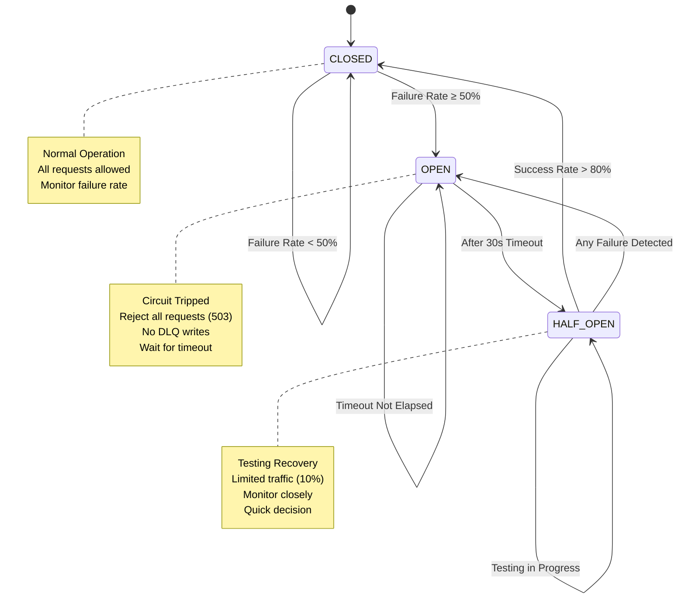
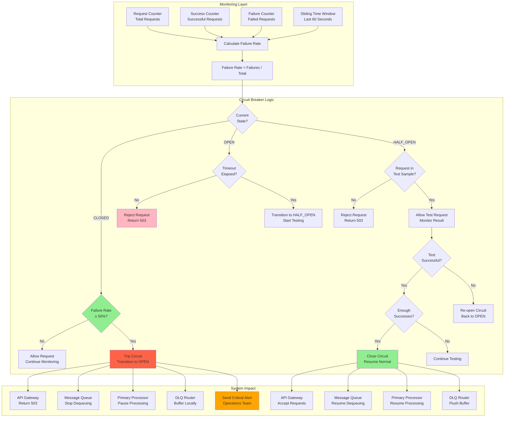

# Circuit Breaker Integration Flow

## Circuit Breaker States & Transitions



## Complete Circuit Breaker Flow



## Integration with System Components

### 1. API Gateway Integration

**Purpose**: Reject incoming requests when circuit is OPEN

```javascript
// Express middleware
app.use('/api/messages', async (req, res, next) => {
  const circuitState = await circuitBreaker.getState();
  
  if (circuitState === 'OPEN') {
    return res.status(503).json({
      error: 'Service temporarily unavailable',
      reason: 'Circuit breaker is open',
      retryAfter: circuitBreaker.getRetryAfter()
    });
  }
  
  if (circuitState === 'HALF_OPEN') {
    const allowRequest = circuitBreaker.shouldAllowTestRequest();
    if (!allowRequest) {
      return res.status(503).json({
        error: 'Service in recovery mode',
        reason: 'Limited traffic allowed'
      });
    }
  }
  
  next();
});
```

**Behavior by State**:
- **CLOSED**: Accept all requests normally
- **OPEN**: Return 503 with `Retry-After` header
- **HALF_OPEN**: Accept only test sample (10% of requests)

---

### 2. Message Queue Integration

**Purpose**: Stop dequeuing messages when circuit is OPEN

```javascript
class MessageQueue {
  async dequeue() {
    const circuitState = await circuitBreaker.getState();
    
    if (circuitState === 'OPEN') {
      // Pause dequeuing, don't process new messages
      await this.pauseDequeuing();
      return null;
    }
    
    if (circuitState === 'HALF_OPEN') {
      // Limited dequeuing for testing
      const allowDequeue = circuitBreaker.shouldAllowTestRequest();
      if (!allowDequeue) {
        return null;
      }
    }
    
    return await this.getNextMessage();
  }
}
```

**Behavior**:
- **CLOSED**: Normal dequeuing
- **OPEN**: Pause all dequeuing
- **HALF_OPEN**: Limited dequeuing (10% rate)

---

### 3. Primary Processor Integration

**Purpose**: Report processing results to circuit breaker

```javascript
class PrimaryProcessor {
  async processMessage(message) {
    const startTime = Date.now();
    
    try {
      const result = await this.executeBusinessLogic(message);
      
      // Report success to circuit breaker
      await circuitBreaker.recordSuccess();
      
      return { success: true, result };
    } catch (error) {
      // Report failure to circuit breaker
      await circuitBreaker.recordFailure();
      
      return { success: false, error };
    }
  }
}
```

**Metrics Reported**:
- Success count
- Failure count
- Processing latency
- Error type

---

### 4. DLQ Router Integration

**Purpose**: Handle DLQ writes when circuit is OPEN

```javascript
class DLQRouter {
  async routeToDLQ(message, error) {
    const circuitState = await circuitBreaker.getState();
    
    if (circuitState === 'OPEN') {
      // Circuit open - buffer locally or drop
      if (this.localBuffer.size < MAX_BUFFER_SIZE) {
        this.localBuffer.push({ message, error });
        logger.warn('Circuit open, buffering DLQ message locally');
      } else {
        logger.error('Circuit open and buffer full, dropping DLQ message');
        await this.emitDroppedMessageAlert(message);
      }
      return;
    }
    
    // Normal DLQ write
    await this.persistToMongoDB(message, error);
    
    // If circuit was HALF_OPEN and this succeeds, it helps recovery
    if (circuitState === 'HALF_OPEN') {
      await circuitBreaker.recordSuccess();
    }
  }
  
  async flushLocalBuffer() {
    // Called when circuit closes
    while (this.localBuffer.length > 0) {
      const { message, error } = this.localBuffer.shift();
      await this.persistToMongoDB(message, error);
    }
  }
}
```

**Behavior**:
- **CLOSED**: Write to MongoDB normally
- **OPEN**: Buffer locally (up to limit), then drop with alert
- **HALF_OPEN**: Resume writes, contribute to recovery metrics

---

## Circuit Breaker Configuration

```javascript
const circuitBreakerConfig = {
  // Failure threshold
  failureThreshold: 0.5,           // 50% failure rate trips circuit
  
  // Time window for failure rate calculation
  timeWindowMs: 60000,             // 60 seconds sliding window
  
  // Minimum requests before circuit can trip
  minimumRequests: 10,             // Need at least 10 requests in window
  
  // Open state timeout
  openTimeoutMs: 30000,            // 30 seconds before testing recovery
  
  // Half-open state configuration
  halfOpenMaxRequests: 10,         // Allow 10 test requests
  halfOpenSuccessThreshold: 0.8,   // 80% success rate to close circuit
  
  // Monitoring
  evaluationIntervalMs: 5000,      // Check state every 5 seconds
  
  // Alerting
  alertOnTrip: true,
  alertOnClose: true,
  alertChannels: ['slack', 'pagerduty']
};
```

## Implementation Example

```javascript
class CircuitBreaker {
  constructor(config) {
    this.config = config;
    this.state = 'CLOSED';
    this.failureCount = 0;
    this.successCount = 0;
    this.requestCount = 0;
    this.lastStateChange = Date.now();
    this.halfOpenSuccesses = 0;
    this.halfOpenFailures = 0;
    
    // Sliding window for metrics
    this.metricsWindow = [];
    
    // Start monitoring loop
    this.startMonitoring();
  }
  
  async recordSuccess() {
    this.successCount++;
    this.requestCount++;
    this.addMetric({ type: 'success', timestamp: Date.now() });
    
    if (this.state === 'HALF_OPEN') {
      this.halfOpenSuccesses++;
      await this.evaluateHalfOpenState();
    }
  }
  
  async recordFailure() {
    this.failureCount++;
    this.requestCount++;
    this.addMetric({ type: 'failure', timestamp: Date.now() });
    
    if (this.state === 'HALF_OPEN') {
      // Any failure in HALF_OPEN re-opens circuit
      await this.transitionTo('OPEN');
    }
  }
  
  addMetric(metric) {
    this.metricsWindow.push(metric);
    
    // Remove metrics outside time window
    const cutoff = Date.now() - this.config.timeWindowMs;
    this.metricsWindow = this.metricsWindow.filter(
      m => m.timestamp > cutoff
    );
  }
  
  getFailureRate() {
    if (this.metricsWindow.length < this.config.minimumRequests) {
      return 0; // Not enough data
    }
    
    const failures = this.metricsWindow.filter(m => m.type === 'failure').length;
    return failures / this.metricsWindow.length;
  }
  
  async evaluateState() {
    if (this.state === 'CLOSED') {
      const failureRate = this.getFailureRate();
      if (failureRate >= this.config.failureThreshold) {
        await this.transitionTo('OPEN');
      }
    } else if (this.state === 'OPEN') {
      const elapsed = Date.now() - this.lastStateChange;
      if (elapsed >= this.config.openTimeoutMs) {
        await this.transitionTo('HALF_OPEN');
      }
    }
  }
  
  async evaluateHalfOpenState() {
    const totalTests = this.halfOpenSuccesses + this.halfOpenFailures;
    
    if (totalTests >= this.config.halfOpenMaxRequests) {
      const successRate = this.halfOpenSuccesses / totalTests;
      
      if (successRate >= this.config.halfOpenSuccessThreshold) {
        await this.transitionTo('CLOSED');
      } else {
        await this.transitionTo('OPEN');
      }
    }
  }
  
  async transitionTo(newState) {
    const oldState = this.state;
    this.state = newState;
    this.lastStateChange = Date.now();
    
    logger.info(`Circuit breaker: ${oldState} → ${newState}`);
    
    if (newState === 'OPEN') {
      await this.onCircuitOpen();
    } else if (newState === 'CLOSED') {
      await this.onCircuitClose();
    } else if (newState === 'HALF_OPEN') {
      this.halfOpenSuccesses = 0;
      this.halfOpenFailures = 0;
    }
  }
  
  async onCircuitOpen() {
    // Send alerts
    await alerting.sendCriticalAlert({
      title: 'Circuit Breaker Tripped',
      message: `Failure rate exceeded ${this.config.failureThreshold * 100}%`,
      failureRate: this.getFailureRate(),
      timestamp: new Date()
    });
    
    // Pause system components
    await messageQueue.pauseDequeuing();
    await primaryProcessor.pauseProcessing();
  }
  
  async onCircuitClose() {
    // Send recovery alert
    await alerting.sendInfoAlert({
      title: 'Circuit Breaker Closed',
      message: 'System recovered, resuming normal operation',
      timestamp: new Date()
    });
    
    // Resume system components
    await messageQueue.resumeDequeuing();
    await primaryProcessor.resumeProcessing();
    await dlqRouter.flushLocalBuffer();
    
    // Reset metrics
    this.metricsWindow = [];
  }
  
  shouldAllowTestRequest() {
    if (this.state !== 'HALF_OPEN') {
      return true;
    }
    
    // Allow only limited requests in HALF_OPEN
    const totalTests = this.halfOpenSuccesses + this.halfOpenFailures;
    return totalTests < this.config.halfOpenMaxRequests;
  }
  
  getState() {
    return this.state;
  }
  
  getRetryAfter() {
    if (this.state === 'OPEN') {
      const elapsed = Date.now() - this.lastStateChange;
      const remaining = this.config.openTimeoutMs - elapsed;
      return Math.ceil(remaining / 1000); // seconds
    }
    return null;
  }
  
  startMonitoring() {
    setInterval(async () => {
      await this.evaluateState();
    }, this.config.evaluationIntervalMs);
  }
}
```

## Monitoring & Metrics

### Key Metrics

```javascript
const metrics = {
  // State tracking
  'circuit_breaker.state': 'CLOSED|OPEN|HALF_OPEN',
  'circuit_breaker.state_duration_seconds': 45.2,
  
  // Failure tracking
  'circuit_breaker.failure_rate': 0.35,
  'circuit_breaker.failure_count': 150,
  'circuit_breaker.success_count': 280,
  
  // State transitions
  'circuit_breaker.trips_total': 3,
  'circuit_breaker.recoveries_total': 2,
  
  // Half-open testing
  'circuit_breaker.half_open_successes': 8,
  'circuit_breaker.half_open_failures': 0,
  
  // Impact
  'circuit_breaker.rejected_requests_total': 1250
};
```

### Grafana Dashboard

**Panel 1: Circuit State Timeline**
```
Query: circuit_breaker.state
Visualization: State timeline
Colors: CLOSED=green, OPEN=red, HALF_OPEN=yellow
```

**Panel 2: Failure Rate**
```
Query: circuit_breaker.failure_rate
Visualization: Line chart
Threshold: 0.5 (red line)
```

**Panel 3: Trip/Recovery Events**
```
Query: rate(circuit_breaker.trips_total[5m])
Visualization: Bar chart
```

## Recovery Procedures

### Automatic Recovery
1. Circuit trips to OPEN (failure rate ≥ 50%)
2. Wait 30 seconds (open timeout)
3. Transition to HALF_OPEN
4. Allow 10 test requests
5. If 8+ succeed (80%), close circuit
6. If any fail, re-open circuit

### Manual Recovery
```bash
# Force close circuit (use with caution)
curl -X POST http://localhost:3000/admin/circuit-breaker/force-close \
  -H "Authorization: Bearer $ADMIN_TOKEN"

# Get current state
curl http://localhost:3000/admin/circuit-breaker/status

# Reset metrics
curl -X POST http://localhost:3000/admin/circuit-breaker/reset-metrics
```

### Troubleshooting

**Circuit keeps tripping?**
- Check downstream service health
- Review error logs for root cause
- Verify retry policies aren't too aggressive
- Consider increasing failure threshold temporarily

**Circuit stuck OPEN?**
- Verify timeout configuration
- Check if monitoring loop is running
- Review system clock synchronization
- Manually transition to HALF_OPEN if safe
