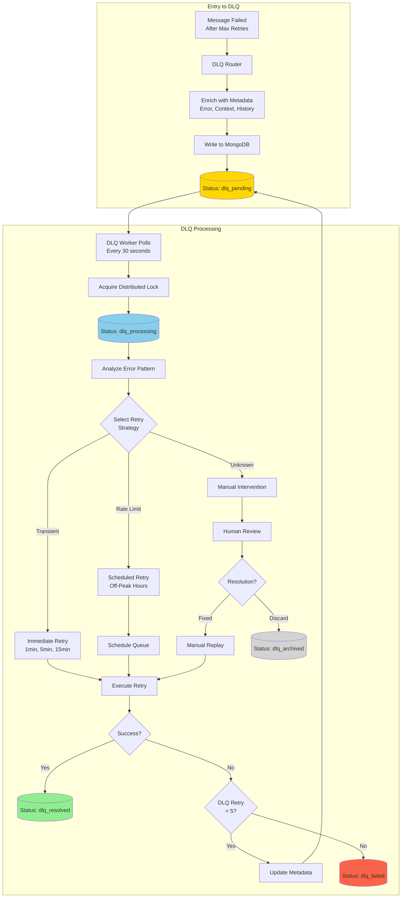
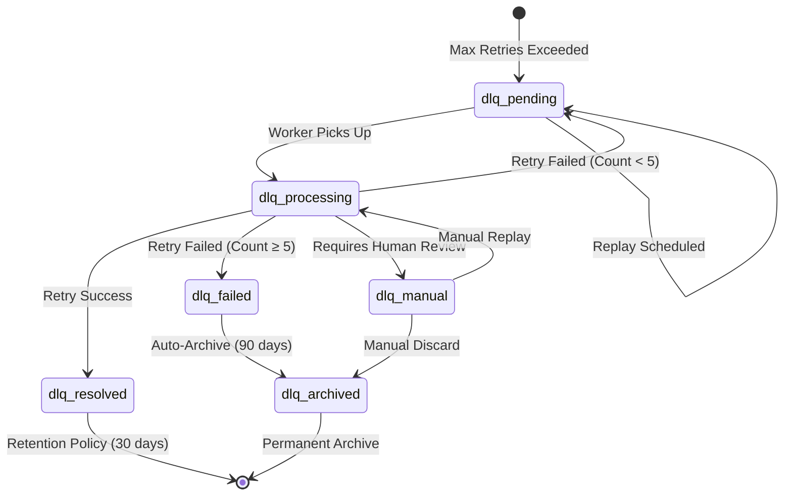
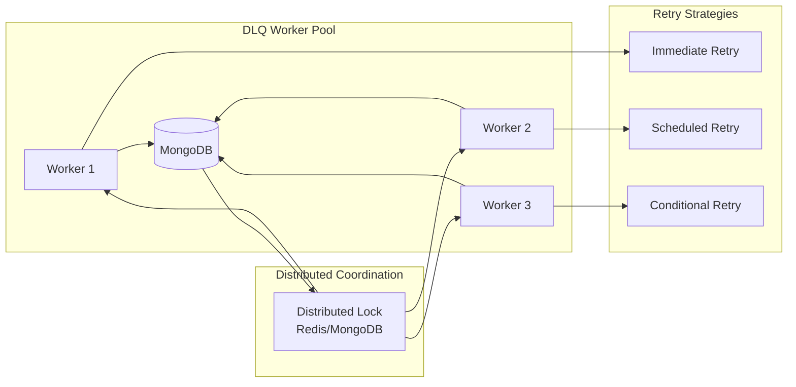
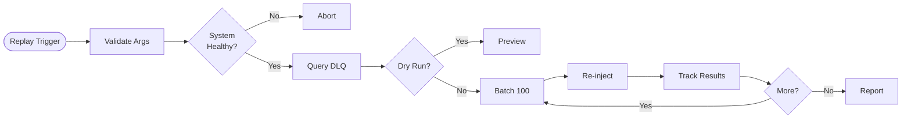

# Dead Letter Queue Lifecycle

## DLQ Message Journey



## DLQ State Machine



## DLQ Worker Service

### Worker Architecture



### Polling Strategy

**Interval**: 30 seconds

**Query**:
```javascript
db.dlq_messages.find({
  status: 'dlq_pending',
  nextRetryAt: { $lte: new Date() },
  lockedBy: null
})
.sort({ priority: -1, createdAt: 1 })
.limit(10);
```

**Distributed Locking**:
```javascript
db.dlq_messages.findOneAndUpdate(
  { _id: messageId, lockedBy: null },
  {
    $set: {
      lockedBy: workerId,
      lockedAt: new Date(),
      status: 'dlq_processing'
    }
  }
);
```

## Retry Strategies

### 1. Immediate Retry
**Use Cases**: Network timeouts, temporary unavailability

**Backoff**: 1min → 5min → 15min → 30min → 1hr

```javascript
const backoffMinutes = [1, 5, 15, 30, 60];
const nextRetryAt = new Date(
  Date.now() + backoffMinutes[retryCount] * 60 * 1000
);
```

### 2. Scheduled Retry
**Use Cases**: API rate limits, quota exhaustion

**Schedule**: Off-peak hours (2am, 3am, 4am)

```javascript
const offPeakHours = [2, 3, 4];
const nextRetryAt = getNextOffPeakTime(offPeakHours);
```

### 3. Conditional Retry
**Use Cases**: Downstream outages, system issues

**Conditions**:
- Circuit breaker CLOSED
- CPU < 80%
- Memory < 85%
- DB connections available

### 4. Manual Intervention
**Use Cases**: Unknown errors, business violations

**Process**:
1. Flag with `status: 'dlq_manual'`
2. Alert operations team
3. Provide debugging interface
4. Manual decision: replay, discard, or modify

## DLQ Metadata Schema

```javascript
{
  _id: ObjectId("507f1f77bcf86cd799439011"),
  messageId: "msg_1707658080_abc123",
  
  originalMessage: {
    userId: "user_123",
    action: "process_payment",
    amount: 99.99
  },
  
  errorReason: "External API timeout after 5000ms",
  errorStack: "Error: timeout\n  at processPayment...",
  errorType: "TIMEOUT_ERROR",
  
  retryCount: 3,
  dlqRetryCount: 2,
  firstFailedAt: ISODate("2026-02-11T12:00:00Z"),
  lastFailedAt: ISODate("2026-02-11T12:00:07Z"),
  
  status: "dlq_processing",
  lockedBy: "worker_node_2",
  lockedAt: ISODate("2026-02-11T12:05:00Z"),
  nextRetryAt: ISODate("2026-02-11T12:10:00Z"),
  
  metadata: {
    source: "payment-service",
    priority: 1,
    tags: ["payment", "critical"],
    systemState: {
      cpuUsage: 0.75,
      memoryUsage: 0.60
    }
  },
  
  replayAttempts: [{
    timestamp: ISODate("2026-02-11T12:05:30Z"),
    workerId: "worker_node_2",
    strategy: "immediate_retry",
    result: "failed"
  }],
  
  createdAt: ISODate("2026-02-11T12:00:07Z"),
  updatedAt: ISODate("2026-02-11T12:05:30Z")
}
```

## Replay Mechanism

### Replay Flow



### Shell Script Usage

```bash
# Replay timeout errors from last 24 hours
./replay-dlq.sh \
  --error-type "TIMEOUT_ERROR" \
  --start-date "2026-02-10T00:00:00Z" \
  --end-date "2026-02-11T00:00:00Z" \
  --batch-size 100

# Dry run preview
./replay-dlq.sh \
  --error-type "RATE_LIMIT_ERROR" \
  --dry-run true
```

### Node.js Implementation

```javascript
async function replayDLQ(options) {
  const { errorType, startDate, endDate, batchSize = 100, dryRun = false } = options;
  
  const query = { status: 'dlq_pending' };
  if (errorType) query.errorType = errorType;
  if (startDate || endDate) {
    query.createdAt = {};
    if (startDate) query.createdAt.$gte = new Date(startDate);
    if (endDate) query.createdAt.$lte = new Date(endDate);
  }
  
  const messages = await db.collection('dlq_messages').find(query).toArray();
  
  if (dryRun) {
    console.log(`Preview: ${messages.length} messages`);
    return;
  }
  
  let successCount = 0;
  for (let i = 0; i < messages.length; i += batchSize) {
    const batch = messages.slice(i, i + batchSize);
    for (const msg of batch) {
      await enqueueMessage(msg.originalMessage);
      successCount++;
    }
    await sleep(1000);
  }
  
  console.log(`Replayed ${successCount} messages`);
}
```

## Metrics & Monitoring

### Key Metrics
- DLQ ingestion rate (msgs/sec)
- DLQ resolution rate (%)
- DLQ backlog (total pending)
- Average time in DLQ
- Error type distribution
- Replay success rate

### Alerts

```yaml
alerts:
  - name: HighDLQIngestionRate
    condition: dlq_ingestion_rate > 100/min
    severity: warning
  
  - name: DLQBacklogGrowing
    condition: dlq_backlog > 10000
    severity: critical
  
  - name: LowResolutionRate
    condition: dlq_resolution_rate < 0.5
    severity: warning
```

## Retention Policy

| Status | Retention | Action |
|--------|-----------|--------|
| `dlq_resolved` | 30 days | Auto-delete |
| `dlq_failed` | 90 days | Cold storage |
| `dlq_archived` | 1 year | Permanent archive |
| `dlq_pending` | No limit | Keep until resolved |
