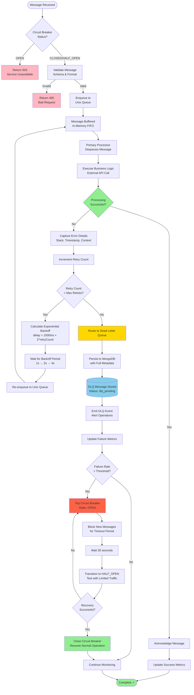
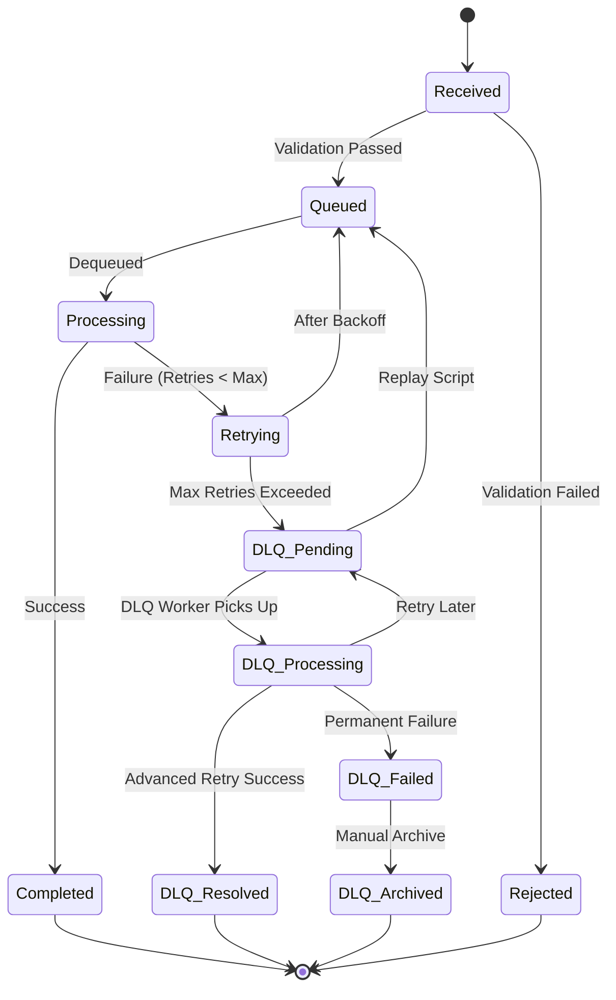

# Detailed Message Flow Diagram

## Complete Message Processing Flow



## Flow Stages Explained

### Stage 1: Message Ingestion
**Components**: API Gateway, Circuit Breaker

1. Message arrives at API Gateway via `POST /api/messages`
2. Circuit Breaker checks current state:
   - **CLOSED**: Accept message (normal operation)
   - **HALF_OPEN**: Accept limited messages for testing
   - **OPEN**: Reject with 503 (system overloaded)
3. Validate message schema and required fields
4. Return 400 if validation fails

**Timing**: < 5ms

---

### Stage 2: Queue Buffering
**Components**: Unix Queue

1. Valid message enqueued to in-memory Unix Queue
2. FIFO ordering maintained
3. Message assigned internal queue ID
4. Return 202 Accepted to client

**Timing**: < 2ms

---

### Stage 3: Primary Processing
**Components**: Primary Processor, Worker Pool

1. Worker dequeues message from Unix Queue
2. Execute business logic:
   - Call external API
   - Transform data
   - Write to database
   - Send notification
3. Capture processing result (success/failure)

**Timing**: Variable (10ms - 5s depending on operation)

---

### Stage 4: Success Path
**Components**: Primary Processor, Metrics

1. Processing completes successfully
2. Acknowledge message (remove from queue)
3. Update success metrics for Circuit Breaker
4. Log successful processing
5. Message lifecycle complete

**Success Rate Target**: > 95%

---

### Stage 5: Failure & Retry Path
**Components**: Retry Manager, Unix Queue

1. Processing fails with error
2. Capture error details:
   - Error message and stack trace
   - Request context and headers
   - System state at failure time
3. Increment retry count for this message
4. Check retry count against max (default: 3)

**If retries remaining**:
5. Calculate exponential backoff delay:
   ```
   Retry 1: 1000ms × 2^0 = 1 second
   Retry 2: 1000ms × 2^1 = 2 seconds
   Retry 3: 1000ms × 2^2 = 4 seconds
   ```
6. Add jitter (±20%) to prevent thundering herd
7. Wait for backoff period
8. Re-enqueue message to Unix Queue
9. Return to Stage 3 (Primary Processing)

**Timing**: Total retry time = 1s + 2s + 4s = 7 seconds

---

### Stage 6: DLQ Routing
**Components**: DLQ Router, MongoDB

**If max retries exceeded**:
1. Route message to Dead Letter Queue
2. Persist to MongoDB with comprehensive metadata:
   ```javascript
   {
     messageId: "msg_12345",
     originalMessage: { /* original payload */ },
     errorReason: "External API timeout after 5000ms",
     errorStack: "Error: timeout\n  at processMessage...",
     retryCount: 3,
     firstFailedAt: "2026-02-11T12:00:00Z",
     lastFailedAt: "2026-02-11T12:00:07Z",
     status: "dlq_pending",
     metadata: {
       source: "payment-service",
       priority: 1,
       requestHeaders: { /* headers */ },
       systemState: { cpuUsage: 0.75, memUsage: 0.60 }
     }
   }
   ```
3. Emit DLQ event for monitoring/alerting
4. Update failure metrics

**Timing**: < 50ms for MongoDB write

---

### Stage 7: Circuit Breaker Evaluation
**Components**: Circuit Breaker

1. Calculate failure rate over sliding window (last 60 seconds):
   ```
   Failure Rate = Failed Messages / Total Messages
   ```
2. Compare against threshold (default: 50%)

**If failure rate ≥ threshold**:
3. Trip circuit breaker to OPEN state
4. Block all new message intake
5. Pause DLQ writes (buffer locally if safe)
6. Send critical alert to operations team
7. Wait for timeout period (30 seconds)
8. Transition to HALF_OPEN state

**In HALF_OPEN state**:
9. Allow limited traffic (10% of normal)
10. Monitor success rate closely
11. If success rate > 80%: Close circuit (resume normal operation)
12. If any failure: Re-open circuit (back to OPEN state)

**Timing**: Circuit evaluation every 5 seconds

---

## Message States



## Performance Metrics

### Latency Targets
- **Ingestion**: < 10ms (p95)
- **Queue Operations**: < 5ms (p99)
- **Successful Processing**: < 100ms (p95)
- **DLQ Write**: < 50ms (p95)
- **Circuit Breaker Check**: < 1ms (p99)

### Throughput Targets
- **Message Intake**: 10,000 msgs/sec
- **Processing**: 5,000 msgs/sec (depends on business logic)
- **DLQ Writes**: 500 msgs/sec
- **DLQ Replay**: 1,000 msgs/sec

### Reliability Targets
- **Message Durability**: 99.99% (no loss after queue acceptance)
- **Processing Success Rate**: > 95% (under normal conditions)
- **DLQ Recovery Rate**: > 80% (with proper debugging)
- **Circuit Breaker Accuracy**: > 99% (no false positives)

## Error Handling Patterns

### Transient Errors (Retry)
- Network timeouts
- Rate limiting (429)
- Temporary service unavailability (503)
- Database connection errors

### Permanent Errors (DLQ Immediately)
- Invalid message format (after validation)
- Authorization failures (401, 403)
- Resource not found (404)
- Business logic violations

### System Errors (Circuit Breaker)
- Cascading failures (> 50% failure rate)
- Resource exhaustion (memory, connections)
- Downstream service outages
- Database unavailability
