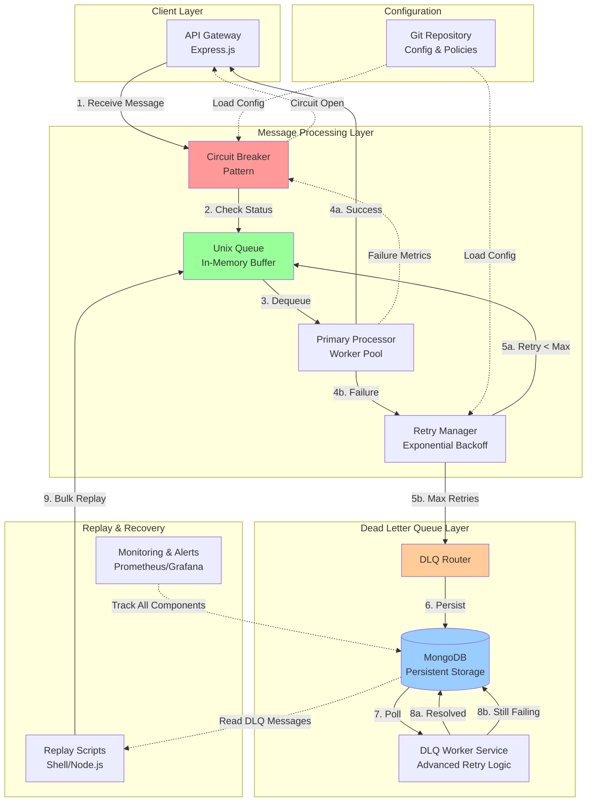

# Production-Grade DLQ Message Processing System
## Architecture Overview

> [!IMPORTANT]
> This system is designed to handle high-throughput message processing with enterprise-grade reliability, inspired by AWS SQS Dead Letter Queue and RabbitMQ Dead Letter Exchange patterns.

## High-Level System Architecture



## Component Responsibilities

### 1. API Gateway (Express.js)
**Purpose**: Message ingestion and primary interface

**Responsibilities**:
- Accept incoming messages via REST endpoints
- Validate message format and schema
- Check circuit breaker status before accepting messages
- Return appropriate HTTP status codes (200, 503, 429)
- Enqueue valid messages to Unix Queue
- Provide health check endpoints

**Key Endpoints**:
- `POST /api/messages` - Submit new message
- `GET /api/health` - System health status
- `GET /api/dlq/stats` - DLQ statistics
- `POST /api/dlq/replay` - Trigger DLQ replay

---

### 2. Unix Queue (In-Memory Buffer)
**Purpose**: Fast, lightweight message buffering

**Responsibilities**:
- FIFO message queue using Unix domain sockets or message queues
- Low-latency enqueue/dequeue operations
- Memory-efficient message storage
- Support for message prioritization (optional)
- Graceful overflow handling

**Technology Options**:
- POSIX message queues (`mq_open`, `mq_send`, `mq_receive`)
- Redis Lists (for distributed scenarios)
- Node.js `bull` or `bee-queue` with Redis backend

---

### 3. Primary Processor (Worker Pool)
**Purpose**: Core message processing logic

**Responsibilities**:
- Dequeue messages from Unix Queue
- Execute business logic (API calls, data transformation, etc.)
- Handle processing errors gracefully
- Report success/failure to Retry Manager
- Maintain processing metrics for Circuit Breaker

**Implementation Pattern**:
```javascript
// Worker pool with configurable concurrency
const workerPool = {
  concurrency: 10,
  processMessage: async (message) => {
    try {
      // Business logic here
      await externalAPI.process(message);
      return { success: true };
    } catch (error) {
      return { success: false, error };
    }
  }
};
```

---

### 4. Retry Manager
**Purpose**: Intelligent retry orchestration

**Responsibilities**:
- Track retry count per message
- Calculate exponential backoff delays
- Re-enqueue messages for retry
- Route to DLQ after max retries exceeded
- Maintain retry history metadata

**Retry Strategy**:
- **Max Retries**: 3 (configurable)
- **Backoff Formula**: `delay = baseDelay * (2 ^ retryCount)`
- **Example**: 1s → 2s → 4s → DLQ
- **Jitter**: Add random ±20% to prevent thundering herd

---

### 5. Circuit Breaker
**Purpose**: System protection and failure isolation

**Responsibilities**:
- Monitor failure rate in sliding time window
- Transition between CLOSED, OPEN, HALF_OPEN states
- Block message intake when circuit is OPEN
- Prevent DLQ writes during cascading failures
- Emit alerts when circuit trips

**Configuration**:
```javascript
{
  failureThreshold: 0.5,      // 50% failure rate
  timeWindow: 60000,          // 60 seconds
  openTimeout: 30000,         // 30 seconds
  halfOpenRequests: 10,       // Test with 10 requests
  recoveryThreshold: 0.8      // 80% success to close
}
```

---

### 6. DLQ Router & MongoDB Storage
**Purpose**: Persistent storage for failed messages

**Responsibilities**:
- Receive messages that exceeded max retries
- Store comprehensive metadata in MongoDB
- Index for efficient querying and replay
- Support status transitions
- Provide query interface for DLQ Worker

**MongoDB Schema**:
```javascript
{
  _id: ObjectId,
  messageId: String,           // Unique message identifier
  originalMessage: Object,     // Original payload
  errorReason: String,         // Last error message
  errorStack: String,          // Stack trace
  retryCount: Number,          // Total retry attempts
  firstFailedAt: Date,         // Initial failure timestamp
  lastFailedAt: Date,          // Most recent failure
  status: String,              // dlq_pending, dlq_processing, dlq_resolved, dlq_failed
  metadata: {
    source: String,            // Origin API/service
    priority: Number,
    tags: [String],
    requestHeaders: Object,
    systemState: Object
  },
  replayAttempts: [{
    timestamp: Date,
    result: String,
    notes: String
  }],
  createdAt: Date,
  updatedAt: Date
}
```

**Indexes**:
- `{ status: 1, createdAt: -1 }`
- `{ messageId: 1 }` (unique)
- `{ "metadata.source": 1, status: 1 }`

---

### 7. DLQ Worker Service
**Purpose**: Advanced retry and debugging for DLQ messages

**Responsibilities**:
- Poll MongoDB for `dlq_pending` messages
- Apply different retry strategies (immediate, scheduled, manual)
- Provide debugging hooks and logging
- Update message status based on retry results
- Escalate permanently failed messages
- Generate error reports for operations team

**Worker Strategies**:
1. **Immediate Retry**: Retry with longer backoff (minutes/hours)
2. **Scheduled Retry**: Retry at specific times (off-peak hours)
3. **Manual Intervention**: Flag for human review
4. **Conditional Replay**: Retry only if system conditions met

---

### 8. Replay Scripts
**Purpose**: Bulk message recovery after system fixes

**Responsibilities**:
- Query DLQ by filters (error type, time range, source)
- Validate system health before replay
- Re-inject messages to Unix Queue or Primary Processor
- Track replay success/failure rates
- Support dry-run mode for testing

**Shell Script Example**:
```bash
#!/bin/bash
# replay-dlq.sh

ERROR_TYPE=$1
START_DATE=$2
END_DATE=$3

node scripts/replay.js \
  --error-type "$ERROR_TYPE" \
  --start-date "$START_DATE" \
  --end-date "$END_DATE" \
  --batch-size 100 \
  --dry-run false
```

---

### 9. Configuration & Policy Management (Git)
**Purpose**: Version-controlled system configuration

**Responsibilities**:
- Store retry policies, circuit breaker thresholds
- Maintain DLQ routing rules
- Track configuration changes with Git history
- Support environment-specific configs (dev, staging, prod)
- Enable rollback to previous configurations

**Config Structure**:
```
config/
├── retry-policies.json
├── circuit-breaker.json
├── dlq-routing.json
├── worker-pool.json
└── monitoring.json
```

---

## Data Flow Summary

1. **Message Ingestion**: API Gateway → Circuit Breaker Check → Unix Queue
2. **Processing**: Unix Queue → Primary Processor → Success/Failure
3. **Retry Flow**: Failure → Retry Manager → Backoff → Re-enqueue (if retries < max)
4. **DLQ Routing**: Max Retries → DLQ Router → MongoDB
5. **DLQ Processing**: DLQ Worker → Poll MongoDB → Advanced Retry → Update Status
6. **Replay**: Replay Script → Query DLQ → Re-inject to Queue
7. **Circuit Protection**: Failure Metrics → Circuit Breaker → Block/Allow Messages

---

## Scalability & Fault Tolerance

### Horizontal Scaling
- **API Gateway**: Multiple instances behind load balancer
- **Primary Processor**: Worker pool with configurable concurrency
- **DLQ Worker**: Multiple workers with distributed locking
- **MongoDB**: Replica set for high availability

### Fault Tolerance
- **Circuit Breaker**: Prevents cascading failures
- **Persistent DLQ**: No message loss even during system crashes
- **Idempotent Processing**: Messages can be safely retried
- **Health Checks**: Continuous monitoring of all components

### Performance Characteristics
- **Throughput**: 10,000+ messages/second (with proper tuning)
- **Latency**: < 50ms for successful processing
- **DLQ Query**: < 100ms for indexed queries
- **Replay Rate**: 1,000 messages/second (configurable)
